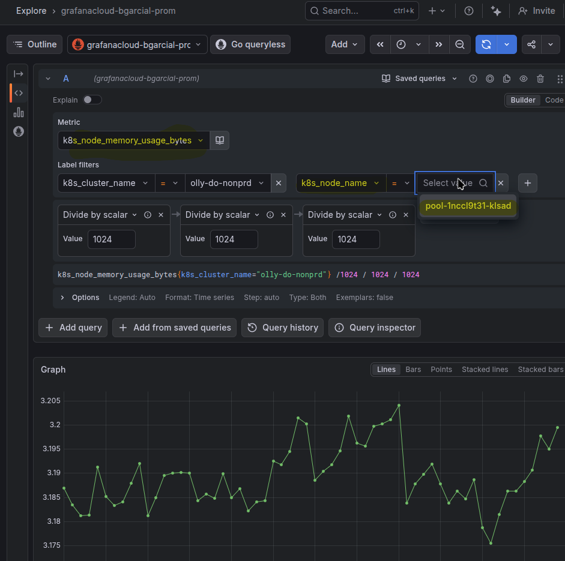

# Changelog

## [1.0.3] - 2026-03-13 ([PR #5](https://github.com/bgarcial/olly-platform/pull/5))

### Fixed

- **`debug` exporter verbosity reduced from `detailed` to `basic`** to fix `max entry size exceeded` errors when exporting logs to Grafana Cloud Loki.
  - **Root cause**: With `verbosity: detailed`, the debug exporter serializes entire span/metric batches as single `logger.Info()` calls via the collector's internal zap logger. These are written to stderr, captured by the kubelet as container log files under `/var/log/pods/`, and then picked up by the `filelog` receiver — which feeds the logs pipeline and sends them to Loki via `otlphttp/logs`. A single batch of spans serialized at `detailed` verbosity produced log lines of ~524KB, exceeding Loki's `max_line_size` limit of 262,144 bytes (256KB).
  - **Side effects**: When Loki rejected an entry with HTTP 400, the entire batch was dropped, including normal-sized log records that happened to be in the same batch. This caused intermittent loss of legitimate application and collector logs.
  - `normal` verbosity was not considered as it writes ~1 line per span/metric record. While each line is small (~200-500 bytes), this duplicates telemetry data already stored in Tempo (traces) and Mimir (metrics) as text log lines in Loki — increasing ingestion costs with no observability benefit. `basic` writes only batch-level counts e.g:
  
```bash
  2026-03-13 12:15:07.316 INFO {
  "level": "info",
  "ts": "2026-03-13T11:15:07.316Z",
  "msg": "Traces",
  "resource": {
    "service.instance.id": "0d1e30e6-d609-4449-af5e-b0c26729d8d6",
    "service.name": "otelcol-k8s",
    "service.version": "0.134.0"
  },
  "otelcol.component.id": "debug",
  "otelcol.component.kind": "exporter",
  "otelcol.signal": "traces",
  "resource spans": 7,
  "spans": 33
} 
```
This kind of proof duplicated data is not getting o the debug exporter.

## [1.0.2] - 2026-03-13

### Changed

- **Telemetry data flow diagram** updated to reflect current architecture:
  - Removed Promtail — logs are now collected by the OTel Collector via the `filelog` receiver.
  - Added OTel Demo as a telemetry source (manual instrumentation sending traces + metrics).
  - Added kubelet as a metrics source via the `kubeletstats` receiver.
  - Backends updated from "TBD — not yet connected" to live Grafana Cloud endpoints (Loki, Mimir, Tempo).
  - Signal Types table expanded with Source, Exporter columns and updated processor chains.
  - Replaced "Switching from Debug" placeholder section with actual Backend Configuration.
- **Deploy how-to** updated:
  - Added VPA prerequisite with link to `docs/VPA.md`.
  - Added Kyverno prerequisite with `helm upgrade --install` command and link to `infrastructure/kyverno/values.yaml`.
  - Added `GRAFANA_CLOUD_LOKI_USER` to the secret creation command and lookup table.
  - Added `logs:write` scope to the `GRAFANA_CLOUD_TOKEN` description.
  - Removed stale "Promtail DaemonSet" reference from Step 1.

### Removed

- Deleted outdated docs: `daemonset-node-topology.md`, `filelog-receiver-operators.md`, Grafana Cloud research notes, troubleshooting `006-collector-oomkilled-filelog-debug-loop.md`.

## [1.0.1] - 2026-03-10 ([PR #2](https://github.com/bgarcial/olly-platform/pull/2))

### Added

- **`kubeletstats` receiver** to scrape resource usage metrics from the kubelet API.
  - `auth_type: "serviceAccount"` is used because:
    - It uses Kubernetes-native RBAC for authorization.
    - It uses the secure kubelet endpoint (port 10250) for authenticated access. More information [here](https://github.com/open-telemetry/opentelemetry-collector-contrib/tree/main/receiver/kubeletstatsreceiver#configuration).
    - The OTel collector DaemonSet already has a dedicated custom ServiceAccount (used by the `k8sattributes` processor to query the K8s API), so the same ServiceAccount is reused to talk to the kubelet API for scraping node, pod, and container metrics. Kubernetes default service accounts should not be used as they are shared across all workloads in a namespace.
  - `insecure_skip_verify: true` is set because:
    - The kubelet's TLS serving certificate is typically not signed by the cluster CA (`/var/run/secrets/kubernetes.io/serviceaccount/ca.crt` trusted by the collector).
    - Without this flag, the collector would reject the kubelet's certificate during the TLS handshake, even though ServiceAccount authentication succeeds.
    - This is acceptable because the collector runs on the same node as the kubelet it connects to.
  - `metric_groups: [ container, pod, node, volume ]` to collect metrics across all resource types.
- **`k8s_api_config` section** on the `kubeletstats` receiver with `auth_type: serviceAccount`.
  - **Problem**: The kubelet's `/stats/summary` endpoint only provides raw usage numbers. It does not include node total capacity (`Status.Capacity`) or pod resource limits/requests.
  - **Solution**: The `k8s_api_config` configures a separate connection to the Kubernetes API server (not the kubelet) so the receiver can fetch the metadata needed to calculate utilization metrics:
    - Node capacity metrics — to calculate `*.node_utilization` metrics.
    - Pod limit/request utilization metrics — to calculate `*.limit_utilization` and `*.request_utilization` metrics.
  - When [`k8s_api_config` is present](https://github.com/open-telemetry/opentelemetry-collector-contrib/blob/v0.134.0/receiver/kubeletstatsreceiver/config.go#L87-L93), a `k8sAPIClient` is created to talk to the Kubernetes API server. Without it, the receiver can still scrape raw usage metrics from the kubelet, but any `*_utilization` metrics that depend on node capacity or pod limits/requests will not work.
- **Non-default metrics enabled** on the `kubeletstats` receiver: `container.uptime`, `k8s.container.cpu.node.utilization`, `k8s.container.cpu_limit_utilization`, `k8s.container.cpu_request_utilization`, `k8s.container.memory.node.utilization`, `k8s.container.memory_limit_utilization`, `k8s.container.memory_request_utilization`, `k8s.node.uptime`, `k8s.pod.cpu.node.utilization`, `k8s.pod.cpu_limit_utilization`, `k8s.pod.cpu_request_utilization`, `k8s.pod.memory.node.utilization`, `k8s.pod.memory_limit_utilization`, `k8s.pod.memory_request_utilization`, `k8s.pod.uptime`.
- **`transform/promote_node_name` processor** to promote `k8s.node.name` from resource attribute to datapoint attribute.
  - **The WHY**:
  I wanted to get `k8s_node_name` as a label for node memory usage metrics, like this:

  

  - **Problem**: `k8s.node.name` is set as a resource attribute by the `k8sattributes` processor, but Grafana Cloud Mimir does not auto-promote all resource attributes to Prometheus labels. Only [a specific set of attributes are promoted](https://grafana.com/blog/opentelemetry-with-prometheus-better-integration-through-resource-attribute-promotion/#enabling-resource-attribute-promotion), and `k8s.node.name` is not in the list.
  - **Solution**: The `transform/promote_node_name` processor copies `k8s.node.name` from the resource to a datapoint attribute. Datapoint attributes always become Prometheus labels — they don't depend on Mimir's resource attribute promotion. [More info about the datapoint model for metrics](https://opentelemetry.io/docs/specs/otel/compatibility/prometheus_and_openmetrics/).
- **`K8S_NODE_IP` environment variable** on the OpenTelemetryCollector CR, sourced from `status.hostIP` via the downward API. Used as the kubelet endpoint: `https://${env:K8S_NODE_IP}:10250`.
- **`kubeletstats` receiver** added to the metrics pipeline receivers.
- **`transform/promote_node_name`** added to the metrics pipeline processors.

### Changed

- `global.cluster` renamed from `olly-personal-nonprd` to `olly-do-nonprd` to differentiate from the local Kind cluster.

## [1.0.0] - 2026-03-02 ([PR #1](https://github.com/bgarcial/olly-platform/pull/1))

### Added

- **OpenTelemetry Collector filelog receiver** as promtail is deprecated.
  - Container parser operator was added.
- **`otlphttp/logs`** exporter to send logs to Loki.
- **`basicauth/loki`** entry to authenticate to Loki Grafana Cloud endpoint.
- `GRAFANA_CLOUD_LOKI_USER` env var and key to the `grafana-cloud-credentials` secret.
- Mounting `/var/log/pods` volume on Open telemetry collector template.
- Documentation about filelog receiver and its operators used.

### Removed

- Promtail daemonset was decomissioned.

## [0.0.4] - 2026-02-25

### Changed

- **`otlphttp/traces` → `otlp/traces` exporter (revert)**: Switched back from OTLP/HTTP to OTLP/gRPC for sending traces to Grafana Cloud Tempo.
  - `global.tempo.endpoint` reverted from `https://host:port` HTTP format back to bare `host:port` gRPC format.
  - `otlphttp/traces` was returning HTTP 404 on `/v1/traces`: `tempo-eu-west-0.grafana.net:443` only exposes a gRPC endpoint; no OTLP/HTTP listener exists at that hostname for this Grafana Cloud stack.
  - Re-added `keepalive.client_parameters` (`time: 30s`, `timeout: 10s`, `permit_without_stream: true`) — required to prevent `DeadlineExceeded` / `connection reset by peer` errors from intermediate load balancers closing idle gRPC connections.
  - Removed `compression: gzip` (was HTTP-specific); removed `tls.insecure: false` duplicate comment.
  - Pipeline `traces.exporters` updated from `otlphttp/traces` back to `otlp/traces`.

---

## [0.0.3] - 2026-02-25

### Changed

- **`otlp/traces` → `otlphttp/traces` exporter**: Switched from OTLP/gRPC to OTLP/HTTP for sending traces to Grafana Cloud Tempo.
  - `global.tempo.endpoint` updated from bare `host:port` gRPC format to `https://host:port` HTTP format.
  - Removed `keepalive` block — keepalive is a gRPC concept for persistent connections; OTLP/HTTP uses stateless requests and does not require it.
  - Added `compression: gzip` to reduce egress bandwidth.
  - Added explicit `tls.insecure: false`.
  - Pipeline `traces.exporters` updated from `otlp/traces` to `otlphttp/traces`.

---

## [0.0.2] - 2026-02-25

### Fixed

- **`otlp/traces` exporter**: Added `keepalive` settings (`time: 30s`, `timeout: 10s`, `permit_without_stream: true`) to fix `DeadlineExceeded` and `connection reset by peer` errors when exporting traces to Grafana Cloud Tempo. These errors were caused by intermediate load balancers closing idle gRPC connections; keepalive probes keep the connection alive between batches.
- **`otlp/traces` exporter**: Removed redundant `tls.insecure: false` — the `otlp` gRPC exporter requires TLS by default; the explicit setting was a no-op.
