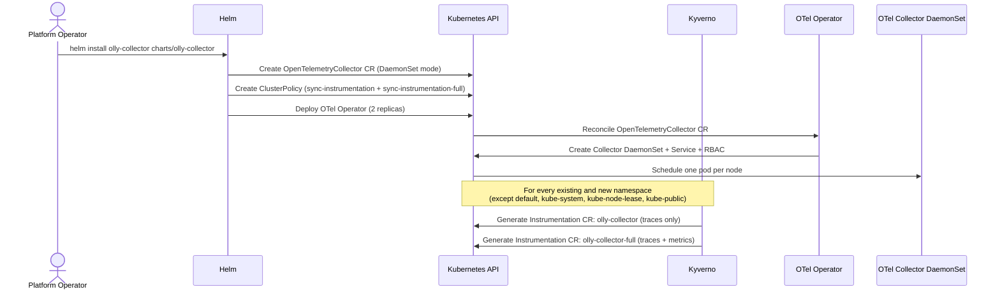
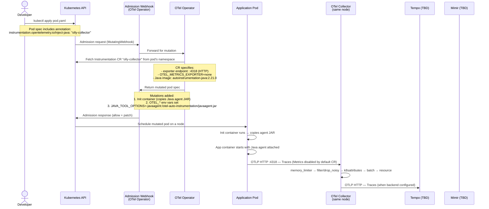
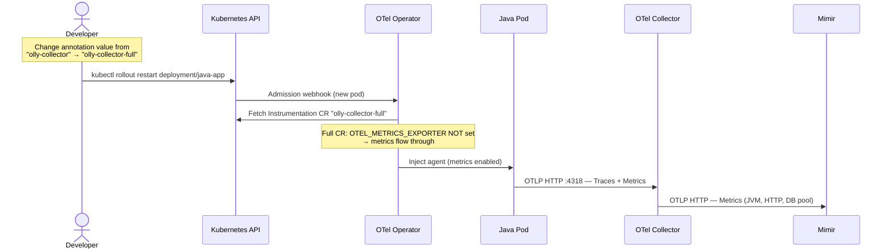

# Auto-Instrumentation Sequence

Shows the timeline of events from pod creation to telemetry flowing through the collector. Covers both the one-time setup phase and the per-pod runtime phase.

## Setup Phase (One Time — Helm Install)

## Runtime Phase (Per Pod)

## Switching to Full Instrumentation (Traces + Metrics)

## Key Timing Notes

| Event | Trigger | Latency |
|-------|---------|---------|
| ClusterPolicy generates Instrumentation CRs | Namespace creation | ~1-5s |
| OTel Operator mutates pod | Pod admission | ~100-500ms |
| Collector starts receiving spans | App container starts | Seconds |
| k8sattributes enriches spans | After pod IP registered | ~5-30s (kube-state-sync) |
| VPA recommends resource adjustments | After ~30min of traffic | 30+ minutes |
