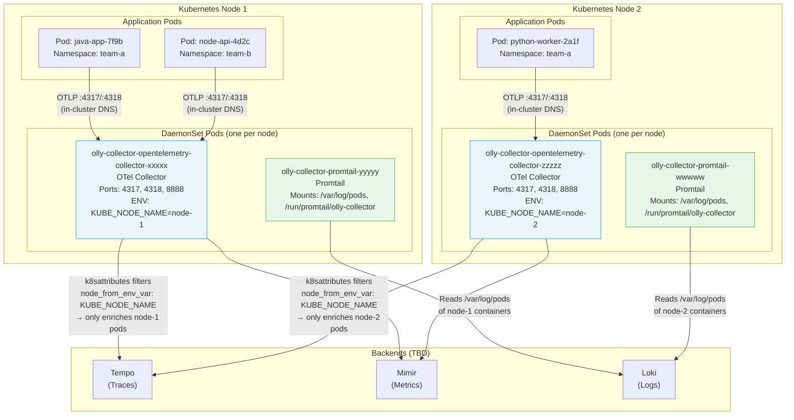

# DaemonSet Node Topology

Shows how exactly one OTel Collector pod and one Promtail pod are scheduled on **every** node, and why each collector only processes telemetry from pods on its own node.

## Diagram



## Why DaemonSet?

| Property | Benefit |
|----------|---------|
| One pod per node | No cross-node network hops for OTLP data |
| `KUBE_NODE_NAME` env var | `k8sattributes` processor scopes pod metadata lookup to its own node |
| Host path mounts (Promtail) | Direct access to `/var/log/pods` without network overhead |
| `tolerations: [{operator: Exists}]` (Promtail) | Runs on tainted nodes too (system nodes, GPU nodes, etc.) |

## In-Cluster OTLP Endpoint

Applications send telemetry to the collector using the Service DNS name (not the DaemonSet pod IP). Kubernetes routes each request to the collector pod on the **same node** via topology-aware routing (when configured) or standard kube-proxy:

```
# gRPC
http://olly-collector-opentelemetry-collector.<namespace>.svc.cluster.local:4317

# HTTP
http://olly-collector-opentelemetry-collector.<namespace>.svc.cluster.local:4318
```

For auto-instrumented pods, this endpoint is set automatically via the Instrumentation CR.

## Promtail Host Paths

```yaml
defaultVolumes:
  - name: run
    hostPath:
      path: /run/promtail/olly-collector   # State (positions file)
  - name: containers
    hostPath:
      path: /var/lib/docker/containers     # Docker container log files
  - name: pods
    hostPath:
      path: /var/log/pods                  # Kubernetes symlinked log paths
```

The `/run/promtail/olly-collector` path (instead of the default `/run/promtail`) prevents conflicts if another Promtail instance runs on the same node.
