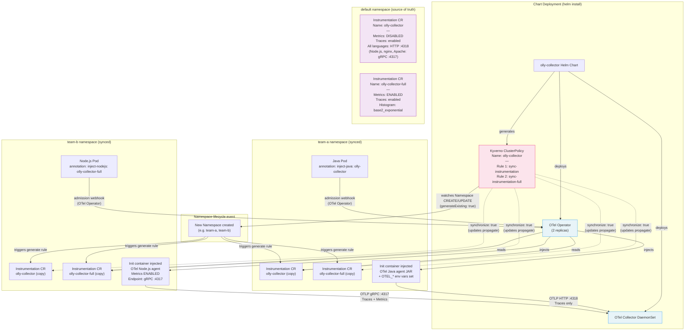

# Kyverno CR Propagation Flow

Shows how the Kyverno ClusterPolicy automatically syncs `Instrumentation` CRs into every namespace so applications can opt in to auto-instrumentation with a single pod annotation.

## Diagram



## Namespace Exclusions

The ClusterPolicy explicitly skips these namespaces (no Instrumentation CRs synced):

```yaml
exclude:
  any:
    - resources:
        namespaces:
          - default         # Source namespace — CRs live here
          - kube-system     # System components
          - kube-node-lease # Node heartbeats
          - kube-public     # Public cluster info
```

## Opting In — Pod Annotation Reference

| Language | Annotation | CR to use | Result |
|----------|------------|-----------|--------|
| Java | `instrumentation.opentelemetry.io/inject-java: "olly-collector"` | Default | Traces only |
| Java | `instrumentation.opentelemetry.io/inject-java: "olly-collector-full"` | Full | Traces + JVM/HTTP metrics |
| Node.js | `instrumentation.opentelemetry.io/inject-nodejs: "olly-collector"` | Default | Traces only (gRPC :4317) |
| Python | `instrumentation.opentelemetry.io/inject-python: "olly-collector"` | Default | Traces only |
| nginx | `instrumentation.opentelemetry.io/inject-nginx: "olly-collector"` | Default | Traces only (gRPC :4317) |
| Apache | `instrumentation.opentelemetry.io/inject-apache-httpd: "olly-collector"` | Default | Traces only (gRPC :4317) |

## Known Issues

| Issue | Location | Fix |
|-------|----------|-----|
| Extra period in endpoint URL | `clusterpolicy.yaml` lines ~50, ~68–76 | Remove trailing `.` from `.svc.cluster.local.:4318` |
| Go not configured | `clusterpolicy.yaml` | Add `go:` section to both rules |
| Python missing from full CR | `sync-instrumentation-full` rule | Add `python:` section with `OTEL_METRICS_EXPORTER: otlp` |

## Synchronization Behaviour

`synchronize: true` in the generate rule means:
- When the source Instrumentation CR in `default` is **updated** → all copies in every namespace are updated automatically
- When a namespace is **deleted** → its copies are removed
- When the ClusterPolicy is **deleted** → all generated resources are removed
