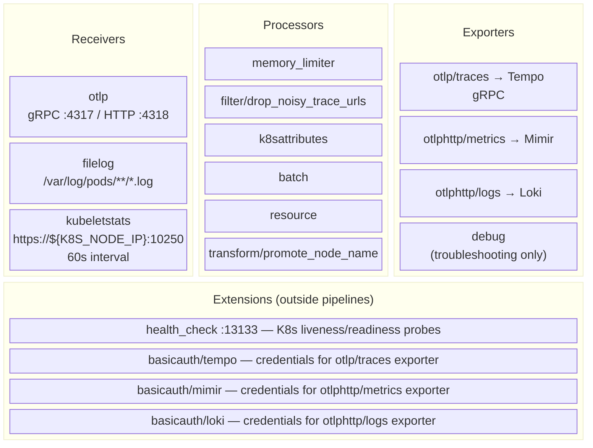
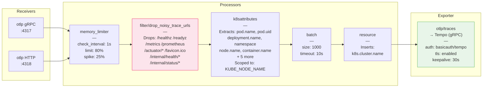
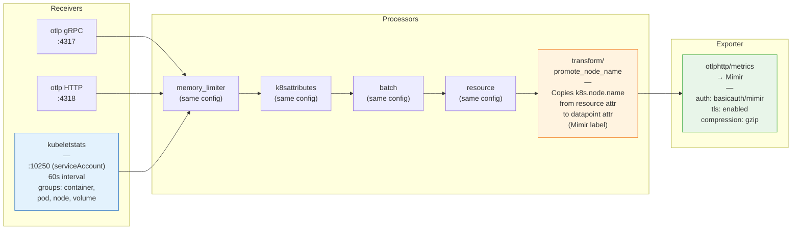
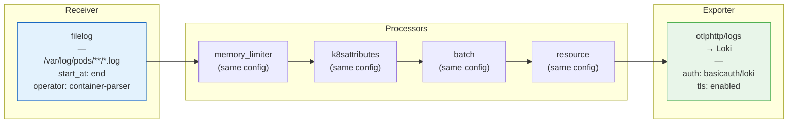

# OTel Collector Components and Pipelines

Maps the olly-collector's OpenTelemetry Collector configuration to the four component categories defined by the [OTel Collector architecture](https://opentelemetry.io/docs/collector/).

## Components Overview

An OTel Collector is built from four component types. Three of them (receivers, processors, exporters) form **pipelines**. The fourth (extensions) operates outside pipelines but can be referenced by pipeline components.



### How extensions relate to pipelines

Extensions are **not** part of any pipeline — they don't process telemetry data. They provide supporting capabilities:

| Extension | Role | Used by |
|-----------|------|---------|
| `health_check` | Exposes `:13133` for K8s probes | Collector pod liveness/readiness — no pipeline connection |
| `basicauth/tempo` | Supplies Basic Auth credentials | `otlp/traces` exporter (via `auth.authenticator`) |
| `basicauth/mimir` | Supplies Basic Auth credentials | `otlphttp/metrics` exporter (via `auth.authenticator`) |
| `basicauth/loki` | Supplies Basic Auth credentials | `otlphttp/logs` exporter (via `auth.authenticator`) |

The `basicauth/*` extensions are referenced by exporters through the `auth.authenticator` field. The collector loads them as extensions and the exporter delegates authentication to them. This keeps auth concerns separated from export logic.

---

## Pipeline Diagrams

Each pipeline defines which receivers feed data in, which processors transform it (in order), and which exporters send it out.

### Traces Pipeline

Includes `filter/drop_noisy_trace_urls` — the only pipeline with a filter processor.



### Metrics Pipeline

No filter. Adds `kubeletstats` receiver and `transform/promote_node_name` processor.



### Logs Pipeline

Uses `filelog` receiver instead of OTLP. Reads container logs directly from the node filesystem.



---

## Self-Observability

The collector exposes its own internal metrics for monitoring.

```yaml
service:
  telemetry:
    metrics:
      readers:
        - pull:
            exporter:
              prometheus:
                host: '0.0.0.0'
                port: 8888
```

Prometheus scrapes `:8888/metrics` for collector health signals: `otelcol_receiver_accepted_spans`, `otelcol_exporter_sent_metric_points`, `otelcol_processor_refused_spans`, `process_runtime_total_alloc_bytes`, etc.

This is configured through `service.telemetry`, not through a pipeline — it's the collector observing itself.

---

## Why Traces Have an Extra Processor

The `filter/drop_noisy_trace_urls` processor only exists in the **traces** pipeline because:

- Health checks (`/healthz`, `/readyz`) and Prometheus scrapes (`/metrics`) generate **constant high-frequency spans**
- 100 pods x 3 probes x 12 calls/min = **3,600 spans/min** of zero-value data
- These span names have **low cardinality** so they don't cause metric cardinality problems in the metrics pipeline

The metrics pipeline has no equivalent filter — metric cardinality is controlled at the SDK level.

## Processor Order Rationale

| Position | Processor | Why Here |
|----------|-----------|----------|
| 1st | `memory_limiter` | Must be first — prevents OOM before any work is done |
| 2nd (traces only) | `filter/drop_noisy_trace_urls` | Drop before enrichment — no point enriching spans we'll discard |
| 2nd/3rd | `k8sattributes` | Enrich with K8s metadata before batching |
| 3rd/4th | `batch` | Group after enrichment to reduce export calls |
| 4th/5th | `resource` | Insert cluster name before export |
| Last (metrics only) | `transform/promote_node_name` | Copy node name to datapoint attrs after resource processor sets it |

## Filter OTTL Expressions Reference

The filter uses OpenTelemetry Transformation Language (OTTL):

```yaml
filter/drop_noisy_trace_urls:
  error_mode: ignore        # Don't fail pipeline on OTTL evaluation errors
  traces:
    span:
      - |                   # Drop span if expression is TRUE
        (attributes["http.method"] == "GET" or attributes["http.request.method"] == "GET") and (
          attributes["http.route"] == "/favicon.ico"   or ...
        )
```

`error_mode: ignore` is important — if an attribute doesn't exist, the expression returns an error rather than false. Ignoring means the span is kept (safe default).
