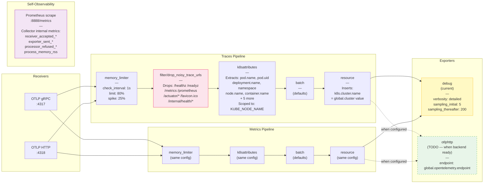

# OTel Collector Internal Pipeline

Shows the processor chains inside the OpenTelemetry Collector for traces and metrics, and why they differ.

## Diagram



## Why Traces Have an Extra Processor

The `filter/drop_noisy_trace_urls` processor only exists in the **traces** pipeline because:

- Health checks (`/healthz`, `/readyz`) and Prometheus scrapes (`/metrics`) generate **constant high-frequency spans**
- 100 pods × 3 probes × 12 calls/min = **3,600 spans/min** of zero-value data
- These span names have **low cardinality** so they don't cause metric cardinality problems in the metrics pipeline

The metrics pipeline has no equivalent filter — metric cardinality is controlled at the SDK level.

## Processor Order Rationale

| Position | Processor | Why Here |
|----------|-----------|----------|
| 1st | `memory_limiter` | Must be first — prevents OOM before any work is done |
| 2nd (traces) | `filter/drop_noisy_trace_urls` | Drop before enrichment — no point enriching spans we'll discard |
| 2nd/3rd | `k8sattributes` | Enrich with K8s metadata before batching |
| 3rd/4th | `batch` | Group after enrichment to reduce export calls |
| Last | `resource` | Insert cluster name as final step before export |

## Health Check Extension

```yaml
extensions:
  health_check:
    endpoint: "0.0.0.0:13133"

service:
  extensions: [health_check]
```

Used by Kubernetes liveness/readiness probes on the collector pod itself.

## Filter OTTL Expressions Reference

The filter uses OpenTelemetry Transformation Language (OTTL):

```yaml
filter/drop_noisy_trace_urls:
  error_mode: ignore        # Don't fail pipeline on OTTL evaluation errors
  traces:
    span:
      - |                   # Drop span if expression is TRUE
        (attributes["http.method"] == "GET" or attributes["http.request.method"] == "GET") and (
          attributes["http.route"] == "/favicon.ico"   or ...
        )
```

`error_mode: ignore` is important — if an attribute doesn't exist, the expression returns an error rather than false. Ignoring means the span is kept (safe default).
