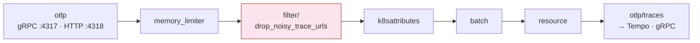
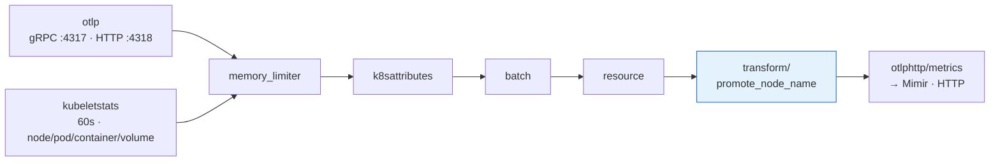
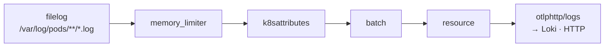

# OTel Collector Pipeline

How telemetry flows through the collector — from ingestion to export.

## Overview

```text
                  OTel Collector · DaemonSet · one per node
┌──────────────────────────────────────────────────────────────┐
│                                                               │
│  ┌─────────────────────────────────────────────────────────┐ │
│  │                        extensions                        │ │
│  │  health_check · basicauth/tempo · basicauth/mimir       │ │
│  │  basicauth/loki                                         │ │
│  └─────────────────────────────────────────────────────────┘ │
│                                                               │
│  ┌──────────────┐   ┌─────────────────┐   ┌───────────────┐ │
│  │ receivers     │   │ processors      │   │ exporters     │ │
│  │               │   │                 │   │               │ │
│  │ otlp          │   │ memory_limiter  │   │ otlp/traces   │ │
│  │ filelog       │──▶│ filter          │──▶│ otlphttp/     │ │
│  │ kubeletstats  │   │ k8sattributes   │   │   metrics     │ │
│  │               │   │ batch           │   │ otlphttp/logs │ │
│  │               │   │ resource        │   │               │ │
│  │               │   │ transform       │   │               │ │
│  └──────────────┘   └─────────────────┘   └───────────────┘ │
│                                                               │
└──────────────────────────────────────────────────────────────┘

Exports to Grafana Cloud:
  otlp/traces      ──▶ Tempo  (gRPC)
  otlphttp/metrics ──▶ Mimir  (HTTP)
  otlphttp/logs    ──▶ Loki   (HTTP)
```

Three pipelines (traces, metrics, logs) share the same collector instance but run independent receiver → processor → exporter chains.

## Pipeline Detail

### Traces



Only pipeline with a filter — drops health-check and probe spans before enrichment.

### Metrics



Two receivers: application metrics via OTLP and infrastructure metrics from the kubelet stats API (node, pod, container, volume).

`transform/promote_node_name` copies `k8s.node.name` from resource attributes to datapoint attributes so Mimir exposes it as a Prometheus label.

### Logs



Reads container logs from the host filesystem. The filelog receiver parses CRI container format and starts at the end of each file (`start_at: end`).

## Processor Order

| Position | Processor | Why here |
|----------|-----------|----------|
| 1st | `memory_limiter` | Must be first — back-pressures before OOM (80% limit, 25% spike) |
| 2nd (traces only) | `filter/drop_noisy_trace_urls` | Drop before enrichment — don't spend CPU on spans we'll discard |
| next | `k8sattributes` | Enrich with pod, namespace, deployment metadata (scoped to local node via `KUBE_NODE_NAME`) |
| next | `batch` | Group after enrichment — reduces export calls (1000 items or 10s window) |
| next | `resource` | Insert `k8s.cluster.name` — identifies which cluster produced this telemetry |
| last (metrics only) | `transform/promote_node_name` | Promote `k8s.node.name` to datapoint attribute — Mimir needs it as a Prometheus label for node-level dashboards |

## Why Traces Have a Filter (and Metrics Don't)

Health checks, readiness probes, and Prometheus scrapes generate constant high-frequency spans with zero diagnostic value:

> 100 pods × 3 probes × 12 calls/min ≈ **3,600 throwaway spans/min**

The filter uses OTTL to drop GET requests matching `/healthz`, `/readyz`, `/metrics`, `/actuator/*`, `/internal/health/*`, `/internal/status/*`, and `/favicon.ico`. It checks three HTTP attribute names (`http.route`, `http.target`, `url.path`) because different OTel SDK versions use different semantic conventions.

`error_mode: ignore` is a safety net — if an attribute doesn't exist on a span, the OTTL expression errors rather than returning false. Ignoring the error means the span is kept (safe default: when in doubt, don't drop).

Metrics don't need this filter. Metric cardinality is controlled at the SDK level (`OTEL_METRICS_EXPORTER=none` in the default Instrumentation CR) and at backend ingestion limits.

## Extensions

| Extension | Purpose |
|-----------|---------|
| `health_check` (:13133) | Kubernetes liveness/readiness probes for the collector pod |
| `basicauth/tempo` | Authenticates trace exports to Grafana Cloud Tempo |
| `basicauth/mimir` | Authenticates metric exports to Grafana Cloud Mimir |
| `basicauth/loki` | Authenticates log exports to Grafana Cloud Loki |

All `basicauth/*` credentials come from the `grafana-cloud-credentials` Secret, mounted as environment variables on the collector pods.

## Self-Observability

The collector exposes its own internal metrics at `:8888` (Prometheus pull):

| Metric | What it tells you |
|--------|-------------------|
| `otelcol_receiver_accepted_*` | Data points accepted per receiver and signal type |
| `otelcol_exporter_sent_*` | Data points successfully exported |
| `otelcol_processor_refused_*` | Data points dropped by processors |
| `process_memory_rss` | Collector memory — compare against the `memory_limiter` threshold |
