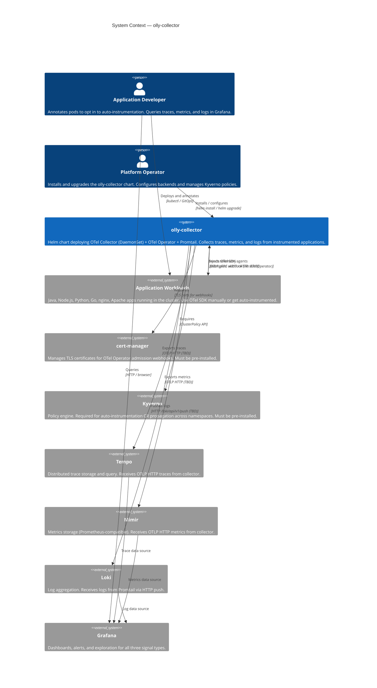

# System Context (C4 Level 1)

Where `olly-collector` sits in the broader observability ecosystem — the relationship between the chart, the applications it instruments, the backends it feeds, and the people who operate it.

## Diagram



## System Boundaries

| System | Owner | Managed by this chart? |
|--------|-------|----------------------|
| OTel Collector DaemonSet | Platform team | **Yes** |
| OTel Operator | Platform team | **Yes** (as dependency) |
| Promtail | Platform team | **Yes** (as dependency) |
| cert-manager | Platform team | No — pre-requisite |
| Kyverno | Platform team | No — pre-requisite |
| Tempo | Platform team | No — separate deployment |
| Mimir | Platform team | No — separate deployment |
| Loki | Platform team | No — separate deployment |
| Grafana | Platform team | No — separate deployment |
| Application workloads | Development teams | No — consumers of this chart |

## Prerequisites (Must Pre-Exist)

```bash
# cert-manager (required for OTel Operator admission webhooks)
helm install cert-manager jetstack/cert-manager \
  --namespace cert-manager --create-namespace \
  --set installCRDs=true

# Kyverno (required for ClusterPolicy CR propagation)
helm install kyverno kyverno/kyverno \
  --namespace kyverno --create-namespace
```
