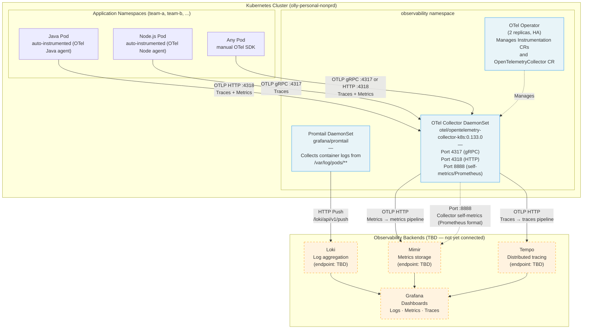

# Telemetry Data Flow

End-to-end flow from instrumented applications through the olly-collector to the observability backends (Loki, Mimir, Tempo) and Grafana.

> **Current state**: The `otlphttp` exporter is commented out — the collector uses the `debug` exporter locally while backends are not yet connected. Replace `debug` with `otlphttp` once `global.opentelemetry.endpoint` is set.

## Diagram



## Signal Types

| Signal | Receiver Port | Processor Chain | Backend |
|--------|--------------|-----------------|---------|
| Traces | 4317 (gRPC) or 4318 (HTTP) | `memory_limiter` → `filter/drop_noisy_trace_urls` → `k8sattributes` → `batch` → `resource` | Tempo |
| Metrics | 4317 (gRPC) or 4318 (HTTP) | `memory_limiter` → `k8sattributes` → `batch` → `resource` | Mimir |
| Logs | /var/log/pods (host path) | CRI parsing → relabeling → labeldrop | Loki |
| Collector self-metrics | :8888 Prometheus scrape | N/A (pulled by Prometheus/ServiceMonitor) | Mimir |

## Switching from Debug to Real Backends

```yaml
# values.yaml — uncomment when backends are available
global:
  opentelemetry:
    endpoint: "https://otlp-http.your-backend.example.com"
  promtail:
    endpoint: "https://loki.your-backend.example.com/loki/api/v1/push"

opentelemetryCollector:
  config:
    exporters:
      otlphttp:
        endpoint: "{{ .Values.global.opentelemetry.endpoint }}"
    service:
      pipelines:
        traces:
          exporters: [otlphttp]
        metrics:
          exporters: [otlphttp]
```
