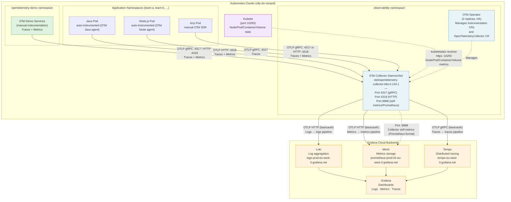

# Telemetry Data Flow

End-to-end flow from instrumented applications through the olly-collector to the Grafana Cloud observability backends (Loki, Mimir, Tempo) and Grafana.

## Diagram



## Signal Types

| Signal | Source | Receiver | Processor Chain | Exporter | Backend |
|--------|--------|----------|-----------------|----------|---------|
| Traces | App pods, OTel Demo | `otlp` (4317 gRPC / 4318 HTTP) | `memory_limiter` → `filter/drop_noisy_trace_urls` → `k8sattributes` → `batch` → `resource` | `otlp/traces` (gRPC, basicauth) | Tempo |
| Metrics | App pods, OTel Demo, kubelet | `otlp` + `kubeletstats` (60s interval) | `memory_limiter` → `k8sattributes` → `batch` → `resource` → `transform/promote_node_name` | `otlphttp/metrics` (basicauth) | Mimir |
| Logs | Container log files | `filelog` (/var/log/pods/**/*.log) | `memory_limiter` → `k8sattributes` → `batch` → `resource` | `otlphttp/logs` (basicauth) | Loki |
| Collector self-metrics | Collector internal | :8888 Prometheus scrape | N/A (pulled by Prometheus/ServiceMonitor) | — | Mimir |

## Backend Configuration

Each backend uses basicauth extensions with Grafana Cloud credentials stored as environment variables (`GRAFANA_CLOUD_TOKEN`, per-service user vars).

```yaml
global:
  tempo:
    endpoint: "tempo-eu-west-0.grafana.net:443"          # OTLP gRPC (bare host:port)
  mimir:
    endpoint: "https://prometheus-prod-01-eu-west-0.grafana.net/otlp"  # OTLP HTTP
  loki:
    endpoint: "https://logs-prod-eu-west-0.grafana.net/otlp"           # OTLP HTTP
```
